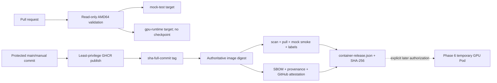
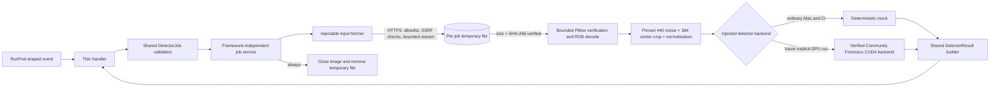

# Community Forensics image worker

## Phase 4 boundary

Phase 4 builds and tests the worker adapter locally with generated image bytes
and a deterministic mock. It does not download the checkpoint, execute the real
model, use CUDA, contact RunPod, publish a container, or connect the worker to
the API.

## Phase 5 container boundary

Phase 5 packages the same service as digest-pinned `mock-test` and
`gpu-runtime` Linux AMD64 targets. Pull requests build, inspect, scan, and run
the generated-fixture mock path without registry credentials. A separate
protected `main`/manual workflow may publish the GPU-shaped target to private
GHCR under the full source-SHA tag, then captures and verifies the immutable
digest, SBOM, provenance, GitHub attestation, package access, and versioned
release manifest. The publication path does not download the checkpoint or run
CUDA; it cannot establish real-model fitness.

The core service imports neither RunPod nor cloud APIs. Its protocols separate
input acquisition, decoding, model inference, and readiness so fake transports
and generated fixtures cover the required behavior without network access.

## Input and decode policy

Only `image/jpeg`, `image/png`, and `image/webp` are accepted. The job MIME,
response MIME, and decoded format must agree with the documented mapping; file
extensions and client filenames have no authority. Downloads are HTTPS-only,
exact-host allowlisted, streamed in bounded chunks, and verified against the
approved byte length and SHA-256 before decode. Redirects are off by default.

The decoder calls Pillow verification before reopening and loading the image.
Truncated images, decompression bombs, unsupported formats, excessive
dimensions, pixel counts, or memory estimates are rejected. EXIF orientation is
applied explicitly; the output is a fresh RGB image with metadata discarded.

## Pinned preprocessing and output

The official evaluation path converts to RGB, resizes the shorter edge to 440
while retaining aspect ratio with Pillow bilinear interpolation, center-crops
384 by 384, scales uint8 RGB to float32 `[0,1]`, applies ImageNet normalization,
and outputs NCHW `(1,3,384,384)`. A SHA-256 fingerprint covers a canonical JSON
representation of every preprocessing parameter and upstream revision.

The real model returns one pre-sigmoid binary classifier logit per image. The
worker records it as an uncalibrated raw score and separately records the
upstream class mapping. It does not interpret it as probability or case truth.

## Real-runtime readiness

Production configuration forbids the mock backend and requires a digest-shaped
container identity. Real fitness verifies CUDA, minimum free VRAM, checkpoint
size and SHA-256, strict state loading, evaluation mode, a deterministic probe,
and `(1,1)` output shape. The model is loaded once per process and inference
runs under `torch.inference_mode()`.

The image uses a digest-pinned Linux AMD64 PyTorch/CUDA base, a non-root user,
external `/models` cache, and separate `/work/tmp` storage. Weights are not baked
into the image. Controlled startup download is operationally flexible but needs
egress and a token; a future verified build can instead stage a checkpoint and
record a new image digest. Either approach must retain hash verification.
