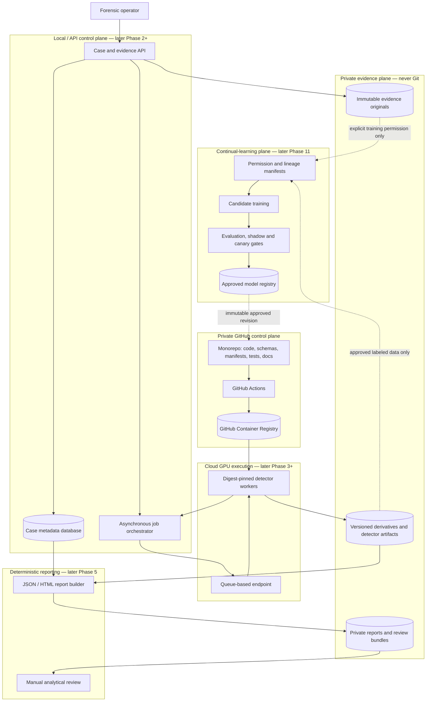

# System overview

## Scope

This document describes the intended system so Phase 1 contracts are designed
for the right trust boundaries. Only the repository foundation and shared
contracts exist today. Components labeled “later” are not implemented.

## Architecture

## Trust boundaries

- Uploaded bytes, names, media metadata, URLs, archives, provider responses, and
  detector output are untrusted until bounded and validated.
- Evidence originals live in private versioned object storage. The control plane
  stores immutable hashes and object versions, not bytes in Git.
- A worker receives a short-lived URL and expected SHA-256. It must bound the
  download, reject redirects or destinations that violate network policy, and
  verify the complete input hash before inference.
- Detector results cross from GPU infrastructure back to the control plane and
  must pass contract, identity, case/evidence ID, and input-hash validation.
- Deterministic report fields are generated from stored records. Narrative review
  cannot edit hashes, scores, versions, preprocessing, or timestamps.
- The continual-learning plane has a separate permission boundary. Production
  case data is ineligible unless explicit training permission and governance are
  recorded.

## GitHub versus private storage

GitHub holds source, schemas, synthetic fixtures, documentation, manifests,
hashes, workflows, model cards, and digest-addressed container metadata. Private
object storage holds evidence, datasets, checkpoints, extracted media,
derivatives, unredacted reports, and caches. An external object is represented in
Git by a manifest containing immutable location/version, size, hash, license,
source, and lineage—not by the object itself.

## Contract compatibility

Every stored root object has `schema_version`. Phase 1 models accept and preserve
unknown fields so a newer producer does not lose data when an older reader loads
and reserializes a record. Current code must not act on unknown fields. Breaking
semantic changes require a new major schema version and an explicit migration.
